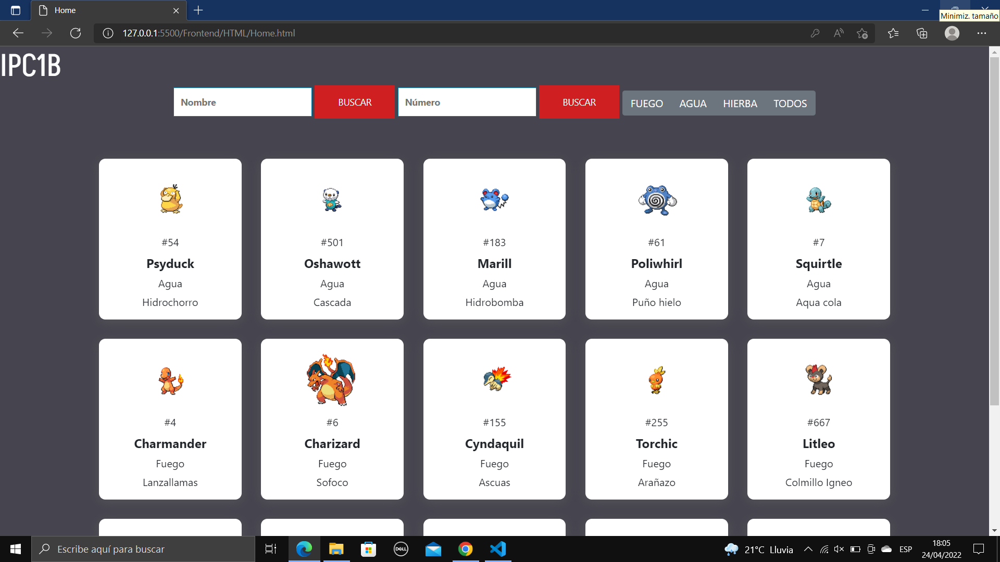
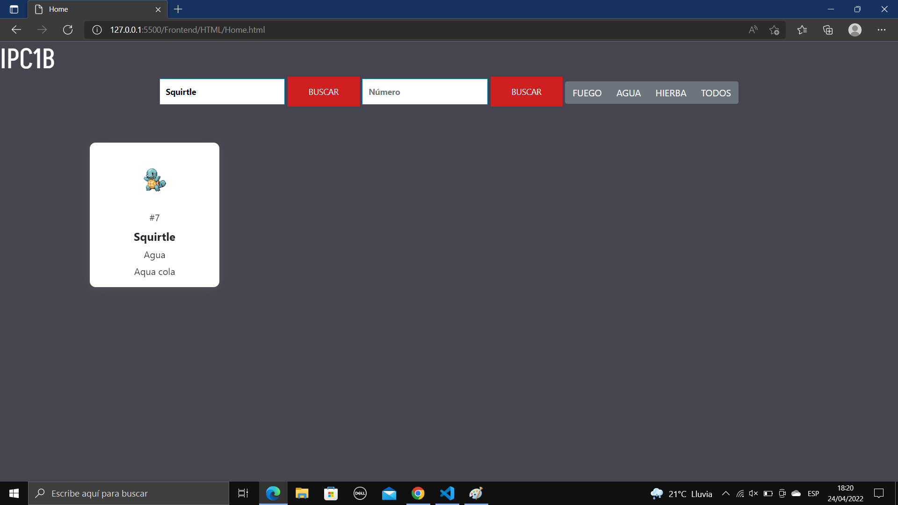

# REPORTE
## TABLA DE DATOS
| Carnet| Nombre Completo |Nombre de Auxiliar 
--- | ---: | :---:
| 202110897 | Lesther Kevin Federico López Miculax | Hector Josue Orozco Salazar 
## FRONTEND
### TECNOLOGÍA UTILIZADA
La aplicación cuenta con un Frontend desarrollado con las tecnologías HTML/CSS/JavaScript, de este modo, se utilizó HTML para separar los elementos que contiene la página como lo son el encabezado, el cuerpo, los botones, las cajas de texto y títulos, de este modo, se logó la estructura de la pagina. Por otro lado, CSS se utilizó para poder darle estilo a la página logrando implementarle colores, fuentes y tamaños para hacer mas agradable la interfaz. Finalmente, se utilizó el lenguaje de programación JavaScript para que la página funcione, por lo que permitió el procesamiento y transformación de los datos enviados y recibidos desde el Backend, por consiguiente, fue util para agregarle funcionalidades a los botones de la página.
### SERVICIOS IMPLEMENTADOS
Algunos de los servicios implementados en la página es  Por otro lado, tambien se implemento la opcion para que el usuario busque lo que necesita visualizar por medio del nombre, numero y tipo.
### MANUAL USO DE APLICACIÓN
El inicio de la página es una interfaz agradable e interactiva, la cual es de facil utilización evitando confusiones o complicaciones al momento de utilizarla haciendo posible un mejor desempeño, de este modo, es posible ingresar el usuario y contraseña en las cajas de texto para posteriormente dar Click en el boton Ingresar y poder ser dirigido al HomePage, sin embargo, si el usuario o la contraseña no coinciden o no estan registrados aparecera un aviso indicanco error.

Posteriormente, se mostrara el HomePage en el cual se encuentran distintas cartas o bloques en las que se hacen visibles los pokemons con su imágen, nombre, número y ataque. 

Ademas, se encuentran en esta interfaz dos cajas de texto con su respectivo boton para poder hacer busqueda de los Pokemons por medio de su nombre o numero.

Finalmente, otra de las utilidades de la página es buscar los pokemons por su tipo haciendo click en el boton adecuado, por añadidura, el fondo del bloque de pokemons cambiara de color dependiendo del tipo seleccionado.

## BACKEND