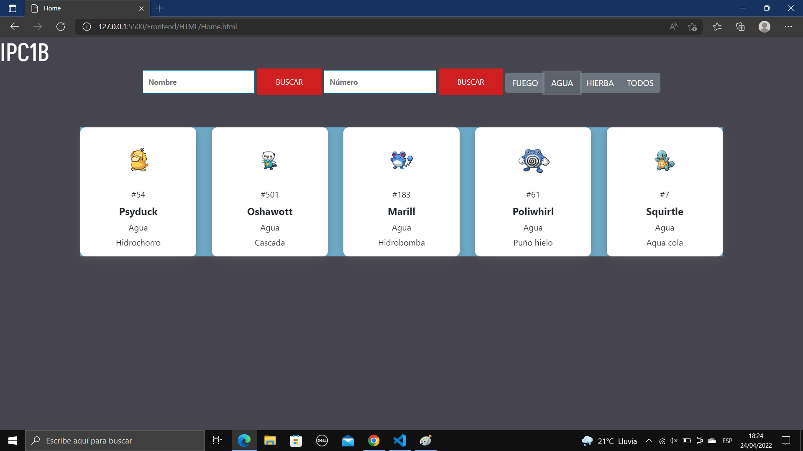

# REPORTE
## TABLA DE DATOS
| Carnet| Nombre Completo |Nombre de Auxiliar 
--- | ---: | :---:
| 202110897 | Lesther Kevin Federico López Miculax | Hector Josue Orozco Salazar 
## FRONTEND
### TECNOLOGÍA UTILIZADA
La aplicación cuenta con un Frontend desarrollado con las tecnologías HTML/CSS/JavaScript, de este modo, se utilizó HTML para separar los elementos que contiene la página como lo son el encabezado, el cuerpo, los botones, las cajas de texto y títulos, de este modo, se logó la estructura de la pagina. Por otro lado, CSS se utilizó para poder darle estilo a la página logrando implementarle colores, fuentes y tamaños para hacer mas agradable la interfaz. Finalmente, se utilizó el lenguaje de programación JavaScript para que la página funcione, por lo que permitió el procesamiento y transformación de los datos enviados y recibidos desde el Backend, por consiguiente, fue util para agregarle funcionalidades a los botones de la página.
### MANUAL USO DE APLICACIÓN
El inicio de la página es una interfaz agradable e interactiva, la cual es de facil utilización evitando confusiones o complicaciones al momento de utilizarla haciendo posible un mejor desempeño, de este modo, es posible ingresar el usuario y contraseña en las cajas de texto para posteriormente dar Click en el boton Ingresar y poder ser dirigido al HomePage, sin embargo, si el usuario o la contraseña no coinciden o no estan registrados aparecera un aviso indicanco error.

Posteriormente, se mostrara el HomePage en el cual se encuentran distintas cartas o bloques en las que se hacen visibles los pokemons con su imágen, nombre, número y ataque. 

Ademas, se encuentran en esta interfaz dos cajas de texto con su respectivo boton para poder hacer busqueda de los Pokemons por medio de su nombre o numero.

Finalmente, otra de las utilidades de la página es buscar los pokemons por su tipo haciendo click en el boton adecuado, por añadidura, el fondo del bloque de pokemons cambiara de color dependiendo del tipo seleccionado.

## BACKEND
### MÓDULOS UTILIZADOS
Uno de los módulos utilizados fué el denominado Express el cual permitió definir rutas que corresponden a los métodos HTTP utilizados como GET y POST. Morgan fué otro módulo utilizado como un registrador de las requests que se fueron solicitando durante la vigencia del servidor. Finalmente, Cors tambien se empleó cors el cual funcionó paara proteger el servidor del acceso de otro sitio webo dominio.
### REQUIRIMIENTOS DEL SISTEMA
Los requirimientos del sistema son minimos, uno de los principales es tener un editor de código fuente para poder inicializar el servidor y hacer posible el funcionamiento de la pokedex, además es importante tener un navegador web para interpretar el codigo HTML.
### PUERTO UTILIZADO Y DESCRIPCIÓN DE LOS ENDPOINTS
El puerto utilizado para poder inicializar el servidor es el número 4000 y los Endpoints fueron cinco. El primero de los endpoints fué el de obtener usuarios por medio de un método get el cual brindó al frontend la información de los usuarios contenida en un json, del mismo modo, también se hizo el mismo método para otro endpoint que se utilizó para obtener los pokemons.

Otro de los métodos utilizados fué el POST el cual hizo posible tres endpints, los cuales se usaron para obtener la información de los pokemons por medio del nombre, número y tipo, por consiguiente, ser enviados al Frontend.